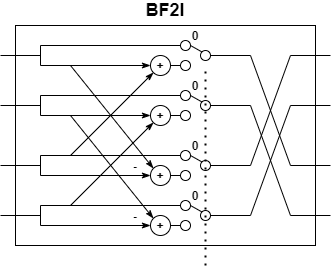
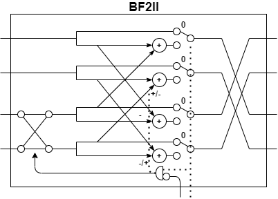
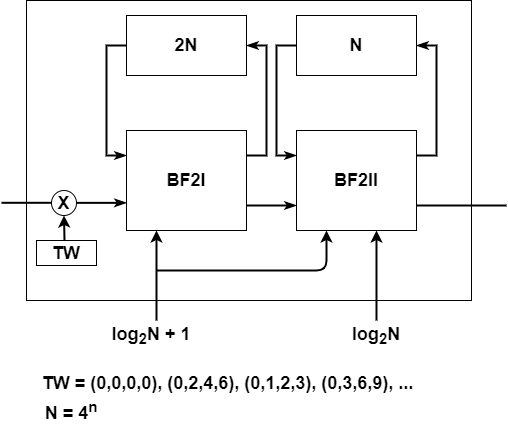

# FFT-R22SDF
R22SDF FFT VLSI/FPGA investigate and implementation

# Architecture

|R22SDF - BF2-Type I|R22SDF - BF2-Type II|
|:---:|:---:|
|||
|R22SDF - Module | |
|| |
	
# These synthesis # are based on ZYNQ 7020 FPGA

## These frabic utilization # can also applied onto Artix 7 series FPGA

	Wo-FF		Point	16		Wo-FF		Point	64		Wo-FF		Point	256		Wo-FF		Point	1024		Wo-FF		Point	4096	
	LUT	1262	53200	2.37		LUT	2370	53200	4.45		LUT	3611	53200	6.79		LUT	5459	53200	10.26		LUT	9567	53200	17.98	
	LUTRAM	66	17400	0.38		LUTRAM	132	17400	0.76		LUTRAM	326	17400	1.87		LUTRAM	1112	17400	6.39		LUTRAM	4170	17400	23.97	
	FF	1048	106400	0.98		FF	2008	106400	1.89		FF	3051	106400	2.87		FF	4138	106400	3.89		FF	6893	106400	6.48	
	DSP	4	220	1.82		DSP	8	220	3.64		DSP	12	220	5.45		DSP	16	220	7.27		DSP	20	220	9.09	
																									
	W-FF		Point	16		W-FF		Point	64		W-FF		Point	256		W-FF		Point	1024		W-FF		Point	4096	
	LUT	1266	53200	2.38		LUT	2378	53200	4.47		LUT	3626	53200	6.82		LUT	5479	53200	10.30		LUT	9591	53200	18.03	
	LUTRAM	66	17400	0.38		LUTRAM	132	17400	0.76		LUTRAM	326	17400	1.87		LUTRAM	1112	17400	6.39		LUTRAM	4170	17400	23.97	
	FF	1155	106400	1.09		FF	2158	106400	2.03		FF	3245	106400	3.05		FF	4381	106400	4.12		FF	7335	106400	6.89	
	DSP	4	220	1.82		DSP	8	220	3.64		DSP	12	220	5.45		DSP	16	220	7.27		DSP	20	220	9.09	
																									
	Wo-FF		Point	16384																					
	LUT	22916	53200	43.08																					
	LUTRAM	16460	17400	94.60																					
	FF	14014	106400	13.17																					
	DSP	24	220	10.91																					
																									
	W-FF		Point	16384																					
	LUT	22951	53200	43.14																					
	LUTRAM	16460	17400	94.60																					
	FF	14577	106400	13.70																					
	DSP	24	220	10.91																					

